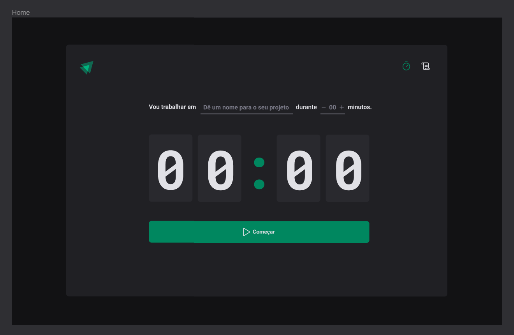

# Ignite-Timer



## Technologies

- `react.js`
- `typescript`
- `styled-components`
- `react-router-dom`
- `react-hook-form`
- `zod`
- `date-fns`

## Installation

```bash
# Clone repository
$ git clone https://github.com/EmanuelQuintino/Ignite-Timer.git

# Install dependencies
$ npm install

# Run project
$ npm run dev
```

## Links

- [Figma](https://www.figma.com/community/file/1127351821076435124)
- [Deploy]()
